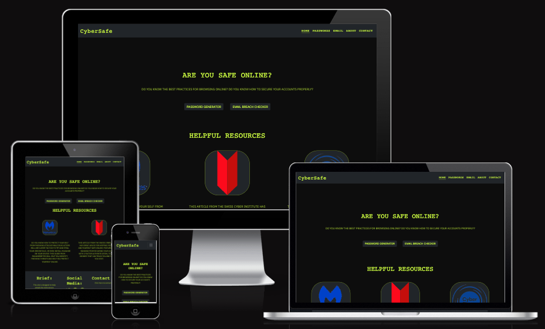
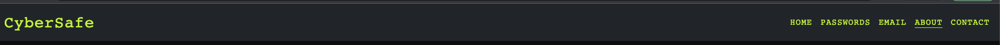
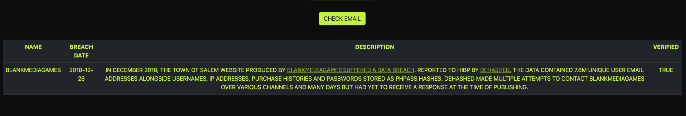
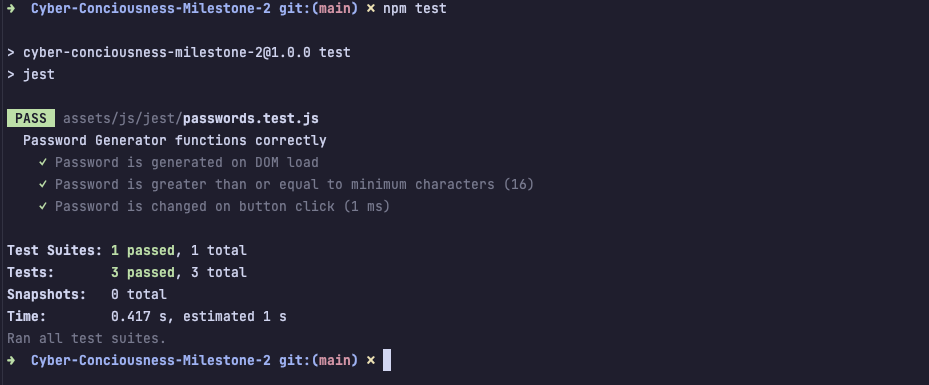

# Security Consciousness Online

This website is designed to act as a information outlet for users who are looking to be more security conscious online. It is an interactive site and is responsive on a number of devices. Using API's I will try to help users be more security conscious online.

The live website can be found [here](https://infiniteendeavours.github.io/Cyber-Conciousness-Milestone-2/).

# Contents

* [User Experience](#user-experience)
	* [Project Discussion](#project-discussion)
	* [User Stories](#user-stories)
* [Design & User Interface](#design-&-user-interface)
	* [Color Palette](#color-palette)
	* [Typography](#typography)
	* [Features](#features)
	* [Images](#images)
	* [Wireframes](#wireframes)
	* [Accessibility](#accessibility)
* [Technologies](#technologies)
	* [Languages Used](#languages-used)
	* [Frameworks, Programs, Libraries and APIs used](#programs-libraries-frameworks-and-apis-used)
* [Deployment & Development](#development-and-deployment)
	* [Local Development](#local-development)
	* [Online Development](#online-development)
	* [Deployment](#deployment)
* [Testing](#testing)
	* [Bugs](#bugs)
	* [Validation](#validation)
	* [Testing User Stories](#testing-user-stories)
	* [Lighthouse](#lighthouse-testing)
    * [Testing Methodologies](#testing-methodologies)
	* [Manual Testing](#manual-testing)
	* [Automated Testing](#automated-testing)
* [Credits](#credits)

# User Experience

## Project Discussion

The aim of this website is to provide people with the knowledge and tools to defend them selves online. It will feature helpful tips, tools to check if they have been exposed in a data breach and a password generator.

Key goals of this project:

* To enable users to defend themselves in an ever changing digital landscape.
* To educate young people and the elderly on what they can do to remain safe online.

## User Stories

### Site Designer Goals

As the designer, I want to be able to;

- Make the site easy to read and informative.
- Make it responsive to accommodate a wide range of devices the different age groups use.
- Feature a password generator to allow for secure password generation.
- Allow users to see if their email has been involved in a data breach.
- Allow users to contact the designer should they have more questions.

### First-Time Visitor

As a first time visitor, I want to be able to;

- View information on how to stay safe online.
- Generate a new password.
- Download safety information.
- Navigate the site easily.

### Returning Visitor

As a returning visitor, I want to be able to;

- Quickly generate a new and secure password.
- Check if my information has been involved in a data breach.
- Share safety resources and tips with friends and family.

# Design & User Interface

## Color Palette

The palette I have chosen is based off of [this palette](https://www.behance.net/gallery/133126993/Tekmain), though I have modified the second colour from #85A60F to #87A810, this was to allow the second colour to pass the WebAIM WCAG AAA standards on the #0D0D0D background.

The main reason for this colour scheme is that I feel, if used appropriately, can give off a futuristic feeling to the website, much like that of Cyberpunk. This kind of theme I feel is used throughout security and will be attractive to the end user.

## Typography

- 'IBM Plex Sans' from Google Fonts. This is a Sans font and will be used for main content, such as paragraphs, buttons and anchor tags.
- 'IBM Plex Mono' from Google Fonts. This is a monospace font and will be used for headings.

## Features

For this website, I have taken on a multi page design, where each page will feature dynamic content.

#### Home Page
The home page will include the following;
- Title of the Website.
- Blurb about increasing your Security Consciousness online.
- Section below the main section of the page to news articles/resources.

#### Passwords Page
The password page will include the following;
- A password generator, which will generate a 32 character password.
- Information and resources on how to create and use a secure password.
- Tips such as using a password manager.

#### Emails Page
The email page will include the following;
- A link to the HaveIBeenPwned API to check if a users email has been compromised in a data breach, with recommended actions if it has been found.
- Information and resources on how to keep their email account and other accounts secure.
- Tips such as using 2 Factor Authentication.

#### About Me Page
The about me page will include the following;
- Why the site was created and the goal I hope to achieve (Educating users on being safe online).
- Link to contact form.

#### Contact Me Page
The contact me page will include the following;
- A form that the user can fill out to contact myself. This will send an email using an email API.

#### All Pages
All pages will include the following;
- Navigation Bar to allow users to navigate to different parts of the website.
- Footer Bar to allow users to view the GitHub repository for the site along with social media links.

## Images
All images used were gathered from google under the Fair Use act.
The images used are as follows;
- The logo of the University Of Boston.
- The logo of the National Cyber Security Center.
- The logo of Tech Safety.
- The logo of Malwarebytes.
- The logo of Bitwarden.
- The logo of the Swiss Tech Institution.
- The logo of Authy.

## Wireframes
The wireframes for this site can be found [here](docs/wireframes/wireframes.pdf).

## Accessibility
I aim to keep the site accessible by following the below points;
- Making sure that all colors used pass the [WebAIM Contrast Checker](https://webaim.org/resources/contrastchecker/).
- Use Semantic HTML on all pages of the site.
- Including the `sr-only` class to ensure that screen readers are accounted for.
- Including alternative text to photos, for people who rely on screen readers.

# Technologies

## Languages Used
Throughout this project, I used a variety of languages, these include;
- HTML
- CSS
- JavaScript

## Programs, Libraries, Frameworks and APIs used
During this project I used the following;
- Bootstrap 5.2 - This was mainly used to create a responsive layout for the site that accommodates all screen sizes used.
- Balsamiq - This was used to create wireframes of the site.
- Git - Version Control Software.
- GitHub - Online Git Repository.
- Gitpod - Online IDE.
- JetBrains WebStorm - Local Development IDE.
- Font Awesome - Social Media Icons.
- Developer Tools - A mixture of Firefox and Chrome Developer tools were used.
- CloudConvert - To convert images from PNGs to SVGs.
- HaveIBeenPwned - Their API was used to check if an email address has been involved in a breach.
- EmailJS - This API was used to allow users of the site to fill out a contact form which is then sent to my email.
- Compressor.io - To Reduce Image Sizes.

# Development and Deployment
During this project, I used a mix of both local and online development.

## Local Development
For Local Development, I used the WebStorm IDE.

I performed the following actions to enable local development of this project;
1. Log into Github
2. Copy the Repository URL.
3. Establish a new terminal session on your local machine.
4. Enter `git clone https://github.com/InfiniteEndeavours/Cyber-Conciousness-Milestone-2`
5. Open WebStorm and open the repository.

Ensure you have Node.JS installed so that you can download the required dependencies (Jest and Jests DOM Environment).

## Online Development
For development in an online IDE, I performed the following;
1. Logged into GitPod.
2. Selected New Workspace.
3. Chose this repository.
4. Awaited the build process.
5. Started Development when loaded.

While I did use GitPod to host an online workspace, I connected to this session via the plugin provided by WebStorm, as this is my preferred IDE.

## Deployment
I used GitHub Pages to deploy the live site.

This was performed by following the below actions;
1. Log into GitHub.
2. Navigate to the repository for the project.
3. Click Settings.
4. Select Pages.
5. Select the Main branch and set the folder to `/root` (This is the default folder), then click save.
6. After the process is complete, (about 2-5 minutes), refresh the page and a URL will be displayed at the top of the screen.

I was required to use a Proxy to work around a CORS error that has been frequently documented about.

Without going too in depth, I used a VPS I own to create a CORS-Anywhere Proxy. I then forwarded my domain, InfiniteEndeavours.co.uk, to it and created an SSL using Lets Encrypt so that the proxy used HTTPS.

HTTPS was needed as you cannot make a call to an API which is using the HTTPS Protocol using a HTTP Proxy.

# Testing
During this project, I used both Google Chrome's and Firefox's development tools to help me with troubleshooting issues encountered in my HTML, CSS and JavaScript (Including API issues).

## Bugs

- Known Issues
  - It is possible when clicking the 'Check Email' button on the Emails page, that the request doesn't reach the Have I Been Pwned API. From my investigation all JavaScript works correctly, and it seems to be an issue between the Proxy server and the HIBP API.
  - A error is logged to the console on the Passwords page. This is due to the fact that to run the JEST test scripts we need to export the module. Chrome does not recognise this as a function.
- Resolved Bugs
  - CORS Error - When querying the Have I been Pwned API, a CORS error was received. The error listed that access to the API was blocked by the browser as there was no 'Access-Control-Allow-Origin' header on the requested resource.
    - The workaround to this was to either use or create a proxy server using CORS-Anywhere.
  - Under 471 pixels wide, the table that is inserted into the DOM via the emailBreach.js file causes some styling issues.
    - When creating the table via JS, I added in the `d-none d-md-block` classes to the description and verified columns.
## Validation
To validate the HTML, CSS and JavaScript of the site. I used the following sites;
- [HTML Validator by W3C](https://validator.w3.org/).
- [CSS Validator by W3C](https://jigsaw.w3.org/css-validator/).
- [JSHint](https://jshint.com/) Installed locally.

### HTML Validation
See below links to the images showing that all HTML documents passed the W3C Validator.

- [index.html](docs/imgs/indexHTMLValidation.png)
- [passwords.html](docs/imgs/passwordsHTMLValidation.png)
- [emails.html](docs/imgs/emailsHTMLValidation.png)
- [about.html](docs/imgs/aboutHTMLValidation.png)
- [contact.html](docs/imgs/contactHTMLValidation.png)

### CSS Validation
The CSS passed the validation with no error, however there were 8 warnings.
- [CSS Validation](docs/imgs/styleCSSValidation.png)

These warnings are due to there being multiple `.btn`selectors with different states.
- [CSS Warnings](docs/imgs/cssValidationWarnings.png)

### JavaScript Validation
The below screenshot shows all three JavaScript files passing the JSHint validation. 
- [JavaScript Validation](docs/imgs/jsJSHintValidation.png)

NOTE: If you are validating this yourself, you must specify the config file which tells JSHint that these files are using ESVersion 6.

`jshint file.js --config ../path/to/.jshintrc`

## Testing User Stories

### Designer
As the designer; 
- The site is easy to read for users.
- It is responsive. [See Am I Responsive Image](docs/imgs/amIResponsive.png).
- Features a password generator.
- Allows the user to check if their email has been involved in a data breach.
- Allows user to contact the designer.

### First-Time Visitor
As a first time visitor;
- View information on how to stay safe online.
  - I can achieve this by using the 'Helpful Resources' section.
  
- Generate a new password.
  - I can achieve this by visiting the 'Password Generator' page and clicking 'Generate Password'.
  
- Download safety information.
  - I cannot download information however there are many useful articles I can visit instead.
- Navigate the site easily.
  - I can navigate the site easily using the navigation menu. 
  

### Returning Visitor
As a returning visitor;
- Quickly generate a new and secure password.
  - I can do this by visiting the passwords page and clicking generate new password.
  
- Check if my information has been involved in a data breach.
  - I can do this by visiting the email page and typing my email address into the search field.
  
- Share safety resources and tips with friends and family.
  - I can do this by looking at the 'Helpful Resources' sections on each page.
  

## Lighthouse Testing

Here are links to the lighthouse tests for each page on both mobile and desktop devices;
- Index
  - [Mobile](docs/lighthouse/indexMobile.png)
  - [Desktop](docs/lighthouse/indexDesktop.png)
- Passwords
  - [Mobile](docs/lighthouse/passwordsMobile.png)
  - [Desktop](docs/lighthouse/passwordsDesktop.png)
- Emails
  - [Mobile](docs/lighthouse/emailsMobile.png)
  - [Desktop](docs/lighthouse/emailsDesktop.png)
- About
  - [Mobile](docs/lighthouse/aboutMobile.png)
  - [Desktop](docs/lighthouse/aboutDesktop.png)
- Contact
  - [Mobile](docs/lighthouse/contactMobile.png)
  - [Desktop](docs/lighthouse/contactDesktop.png)

### Observations
While testing lighthouse, I noticed that whenever running the tests as seen from a mobile, that performance was roughly the same across all tests (94), while desktops easily maintained 100.
I believe this is due to Lighthouse choosing to emulate a Moto G4, which is a low-end device (released 8 years ago). When testing on my mobile phone I see no performance issues.

## Testing Methodologies

For this project, I went with two methods of testing, Behaviour Driven and Test Driven.

### Behaviour Driven / Manual testing

This testing will be used to simulate how an end user interacts with the site. This will involve using the site as a user would, ensuring that access to all pages is working correctly and that all functions are also working as intended.

This kind of testing will usually be seen when a Developer is working with a product manager or user.

### Test Driven / Automated Testing

I used Test Driven behaviour to test the functionality of the password generator, which is made using vanilla JavaScript.
Using JEST, I was able to make sure that the majority of scenarios that the password generator would be in are suitable.

This type of testing will usually be carried out by the Developer. Tests will be written before any code has been written. This helps prevent bugs in the program.

## Manual Testing

To test this website, I used three devices with three different browsers on each. These were;
- Desktop - 3440 x 1440 - Google Chrome, Safari, Firefox
- Laptop - 2560 x 1600 - Google Chrome, Safari, Firefox
- Mobile - 1284 x 2778 (Portrait) and 2778 x 1284 (Landscape) - Google Chrome, Safari, Firefox

### Responsiveness

For my testing, I went through each page of the website on my devices. I observed no issues on my laptop or desktop, however on mobile I did observe an issue with the 'Email' page.

When the results from the Have I been Pwned API were inserted into the DOM, the table had a fixed width. On smaller devices, this caused the styling to break.
To resolve it, I added the Bootstrap classes `d-none d-md-block` to the JavaScript that creates the table column and cells.

This was resolved in [this commit](https://github.com/InfiniteEndeavours/Cyber-Conciousness-Milestone-2/commit/fea86818c789bf8279e136402d0c60c42576cbe9).

### Hyperlinks

I visited all the pages and tested each hyperlink (Navigation Bar, Helpful Resources and Footer links) to ensure that all Hyperlinks worked correctly.

No issues were discovered during this test.

### Password Generator
I was unable to find any issue with the password generator from a user's perspective. 

Testing involved using a macro to spam the generate button however no issues came back from this.

### Email Breach Checker
During my testing on this page, as noted in the [responsiveness](#responsiveness) section, an issue with the styling was found when the table was inserted into the DOM.

### About Page
No issues were found on the about page.

### Contact Form
No issues were found on the contact page.

## Automated Testing

I performed Automated testing on the Password Generator using the JEST Framework.

For the automated testing, I created a series of tests. These were;
- To make sure that upon completion of loading the DOM, that a password was generated and presented to the user.
- To make sure that the password which is generated is equal or greater than 16 characters in length.
- To make sure that on click of the 'Generate Password' button, that a new password is generated.

The code for these tests can be found [here](assets/js/jest/passwords.test.js).

All tests passed successfully.

# Credits

## Content
The Password Generator was written by myself.

The API which is used to check for a users email in a data breach was provided via [haveIBeenPwned](https://www.haveibeenpwned.com).

All articles were sourced from Google and are property of their respective owners.

Logos are used under the 'Fair Use' act.

## Code

While not a part of the website, the proxy which is used to resolve an error with CORS (Cross Origin Resource Sharing), was inspired by [this post](https://stackoverflow.com/questions/60066942/cors-anywhere-how-to-add-https-support). 

Using the CORS-Anywhere module, created by [Rob](https://github.com/Rob--W), I was able to setup my own Proxy on a Virtual Private Server.

Certificates for the proxy were generated using Lets Encrypt/Cert Bot.

## Acknowledgements

- Jack Wachira - My Code Institute Mentor.